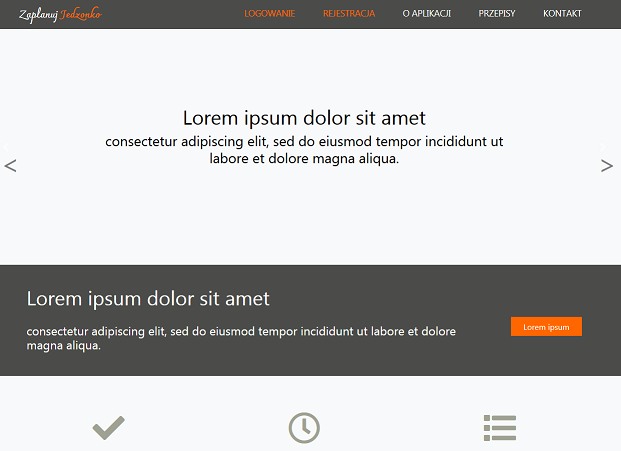
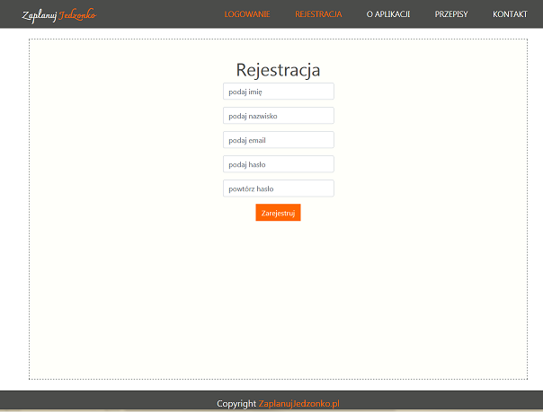
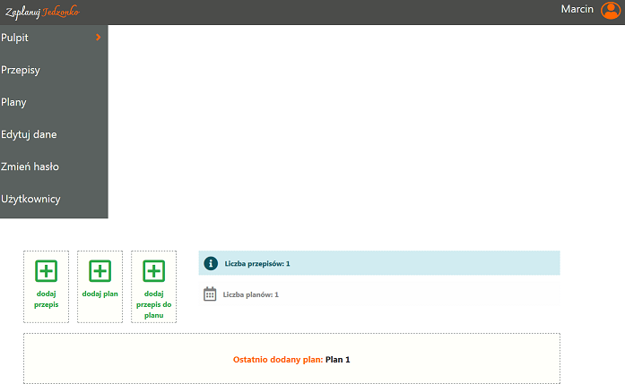
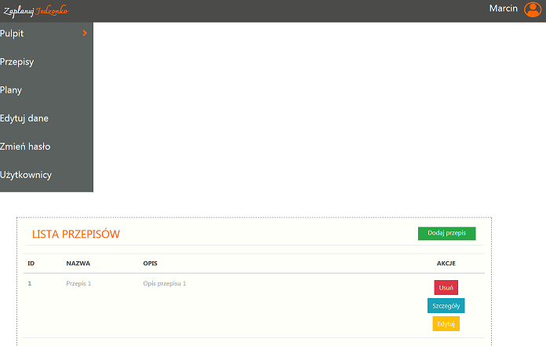
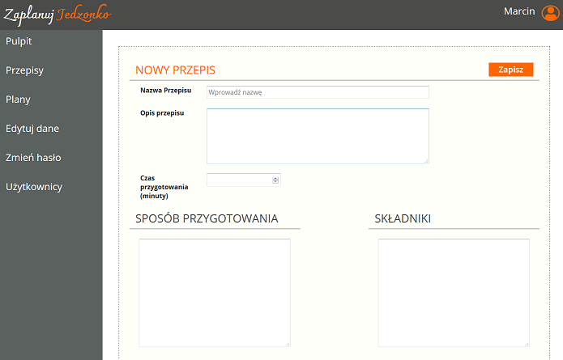
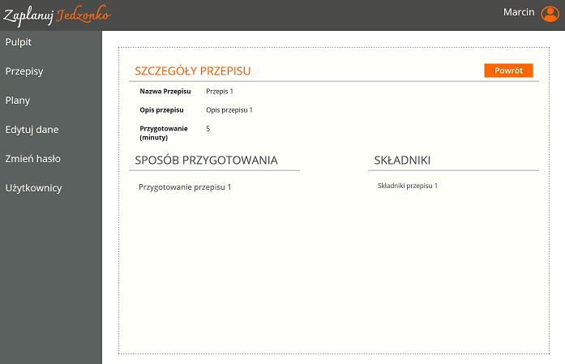

# ZaplanujJedzonko
## Projekt ScrumLab

### Opis programu
Aplikacja do planowania posiłków z możliwością tworzenia przepisów i menu dla różnych użytkowników. 

Projekt zrealizowany w zespole Scrum w ramach kursu programowania. 

Strona główna programu

Możliwość rejestracji nowych użytkowników

Dodawanie nowych planów, przepisów oraz posiłków

### Zastosowane technologie: 
Servlet, JDBC, JSP
